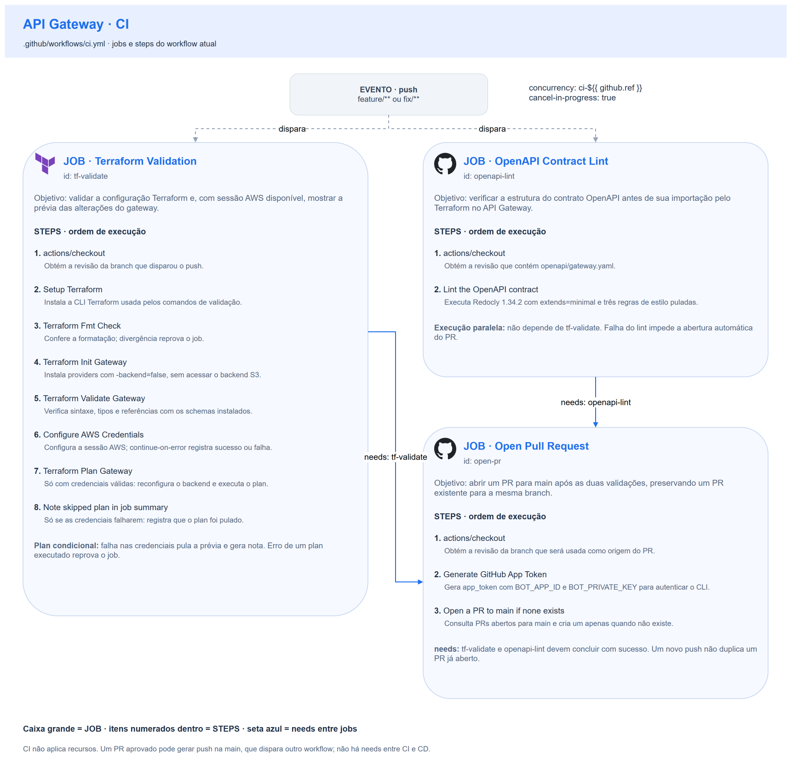
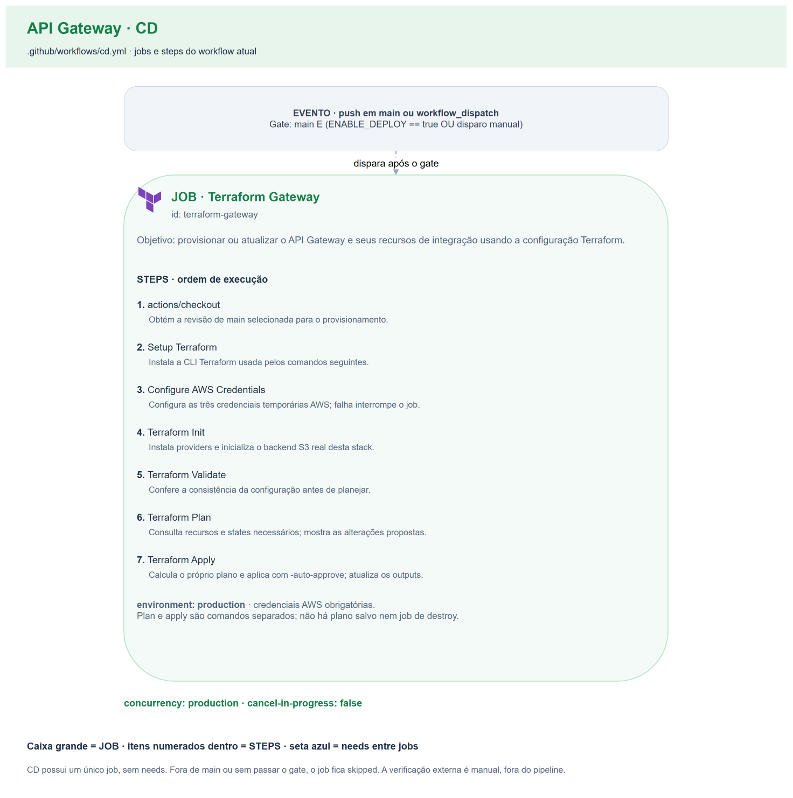

# 🔄 CI/CD

Os dois workflows job a job, os gates que os protegem, a tabela completa de configuração externa e como verificar que um provisionamento resultou em serviço utilizável.

## Índice

- [Visão geral](#visão-geral)
- [Workflow de CI](#workflow-de-ci)
- [Workflow de CD](#workflow-de-cd)
- [Verificação externa após o provisionamento](#verificação-externa-após-o-provisionamento)
- [Configuração externa](#configuração-externa)
- [Diferenças em relação aos demais repositórios de infraestrutura](#diferenças-em-relação-aos-demais-repositórios-de-infraestrutura)

## Visão geral

| Workflow | Gatilho | Concorrência | O que faz |
|---|---|---|---|
| [`ci.yml`](../.github/workflows/ci.yml) | `push` em `feature/**` e `fix/**` | `ci-<ref>`, **cancela** execuções obsoletas | Valida Terraform e o contrato OpenAPI, tenta um `plan`, abre o PR |
| [`cd.yml`](../.github/workflows/cd.yml) | `push` na `main` ou **Run workflow** | `production`, **não cancela** — enfileira | Provisiona sob o environment `production` |

As permissões do `GITHUB_TOKEN` são `contents: read`; a abertura do PR usa o
token efêmero do GitHub App instalado com permissão para criar Pull Requests.
O environment `production` fornece seu escopo de execução; reviewers não são
pré-requisito, e uma branch policy restrita a `main` é hardening opcional.

Nos diagramas, cada caixa grande representa um **job**, com seu objetivo e os
**steps em ordem**, acompanhados de uma explicação breve. As setas azuis
representam dependências `needs` entre jobs. No CI, `tf-validate` e
`openapi-lint` executam em paralelo; `open-pr` depende do sucesso de ambos.
O CD tem um único job, `terraform-gateway`, sem `needs` com o workflow de CI.

**CI — validações e abertura do PR**



**CD — provisionamento do gateway**



## Workflow de CI

Todo `push` em branch de trabalho valida o repositório **inteiro** — não há detecção condicional de mudança. Um novo commit na mesma branch **cancela** a execução anterior.

### Job `tf-validate`

| # | Step no workflow | O que faz |
| --- | --- | --- |
| 1 | actions/checkout | Obtém a revisão que disparou o workflow; os comandos seguintes usam esse checkout. |
| 2 | Setup Terraform | Instala/configura a CLI Terraform para os comandos seguintes. |
| 3 | Terraform Fmt Check | Executa `terraform fmt -check -recursive`; divergência de formatação reprova o job. |
| 4 | Terraform Init Gateway | Executa `terraform init -backend=false -no-color`: instala os providers sem conectar ao backend. Registry/cache indisponível pode reprovar. |
| 5 | Terraform Validate Gateway | Executa `terraform validate -no-color` com os schemas instalados; inconsistência de sintaxe, tipo ou referência reprova. |
| 6 | Configure AWS Credentials | Configura access key, secret key e session token da mesma sessão AWS, em us-east-1. Este step tolera falha e conserva `aws_creds.outcome` para decidir entre plan e nota de skip. |
| 7 | Terraform Plan Gateway | Só com `aws_creds.outcome == success`: executa init com backend (`-reconfigure`) e plan. Qualquer erro desses comandos reprova o job. |
| 8 | Note skipped plan in job summary | Só com `aws_creds.outcome == failure`: registra no resumo que a prévia foi pulada; não ignora erro de um plan executado. |

O `plan` é **opcional por decisão**: as credenciais do laboratório são efêmeras e o ambiente fica desligado a maior parte do tempo. Sem elas, o job segue verde e registra no `$GITHUB_STEP_SUMMARY` que a prévia foi pulada — `fmt` e `validate` já garantiram o que precisava ser garantido, e nenhum dos dois exige nuvem.

### Job `openapi-lint`

| # | Step no workflow | O que faz |
| --- | --- | --- |
| 1 | actions/checkout | Obtém a revisão que disparou o workflow; os comandos seguintes usam esse checkout. |
| 2 | Lint the OpenAPI contract | Executa o lint estrutural do contrato `openapi/gateway.yaml` com Redocly, na configuração explicada abaixo; falha do lint reprova. |

Executa `redocly lint` sobre `openapi/gateway.yaml`.

Este job **é a mitigação declarada** de uma decisão: com o contrato entrando pelo `body` da API, alguns erros de integração só aparecem em tempo de `apply`. O [ADR 0002](adr/0002-contrato-do-gateway-em-openapi.md) registra o experimento que motivou `fail_on_warnings`: impedir uma rota sem target quando o import emite warning.

```bash
npx --yes @redocly/cli@1.34.2 lint openapi/gateway.yaml \
  --extends=minimal \
  --skip-rule=security-defined \
  --skip-rule=no-empty-servers \
  --skip-rule=operation-operationId
```

`--extends=minimal` mantém a **validação estrutural** da especificação ligada. As três regras puladas são opinativas de estilo de API pública e não dizem nada sobre validade:

| Regra pulada | Por quê |
|---|---|
| `security-defined` | O API Gateway não declara `security` porque **não autentica** — ver [ADR 0004](adr/0004-autenticacao-permanece-nos-backends.md) |
| `no-empty-servers` | O endereço só existe depois do provisionamento; exigi-lo seria versionar um valor que o Terraform produz |
| `operation-operationId` | Serve a geradores de cliente, que este documento não alimenta |

O job aceita sem falso positivo as construções específicas do provedor — extensões `x-amazon-apigateway-*`, o `$ref` para `components.x-amazon-apigateway-integrations`, o método coringa e a variável de caminho gulosa — e continua reprovando sintaxe inválida, operação sem `responses` e response sem `description`.

> **Limitação conhecida.** A validação estrutural alcança apenas operações declaradas com métodos padrão da especificação. A rota de proxy usa `x-amazon-apigateway-any-method`, que é **extensão** — seu conteúdo fica fora do schema. Na prática isso não tem consequência: foi verificado contra a AWS que o import aceita um documento sem o `parameters` do `proxy` e cria rota e integração corretamente.

### Job `open-pr`

Depende de `tf-validate` **e** `openapi-lint`. Abre o Pull Request para `main` de forma **idempotente** — consulta se já existe um aberto para a branch antes de criar. Um segundo push na mesma branch não duplica.

Autentica com um **GitHub App token**, no mesmo padrão de `infra-base` e `k8s`.

| # | Step no workflow | O que faz |
| --- | --- | --- |
| 1 | actions/checkout | Obtém a revisão que disparou o workflow; os comandos seguintes usam esse checkout. |
| 2 | Generate GitHub App Token | Gera `app_token` com a variable `BOT_APP_ID` e o secret `BOT_PRIVATE_KEY`; o próximo step recebe o token como `GH_TOKEN`. |
| 3 | Open a PR to main if none exists | Consulta `gh pr list` para head → main e cria o PR só se não houver um aberto; erro do CLI reprova o job. |

## Workflow de CD

Um único job, `terraform-gateway`, sob o environment `production`.

| # | Step no workflow | O que faz |
| --- | --- | --- |
| 1 | actions/checkout | Obtém a revisão que disparou o workflow; os comandos seguintes usam esse checkout. |
| 2 | Setup Terraform | Instala/configura a CLI Terraform para os comandos seguintes. |
| 3 | Configure AWS Credentials | Configura access key, secret key e session token da mesma sessão AWS, em us-east-1. |
| 4 | Terraform Init | Executa `terraform init -no-color`, instalando providers e configurando o backend S3 real. |
| 5 | Terraform Validate | Executa `terraform validate -no-color`; inconsistência de configuração reprova o job. |
| 6 | Terraform Plan | Executa `terraform plan -no-color`; consulta providers e states necessários e mostra as alterações. |
| 7 | Terraform Apply | Executa `terraform apply -auto-approve -no-color`; calcula seu próprio plano, pois não há plano salvo no step anterior. |

**Três proteções:**

1. **`concurrency: production` com `cancel-in-progress: false`.** Um provisionamento nunca é interrompido no meio; o grupo tem escopo neste repositório. Sem fila adicional, apenas um run fica pendente e um novo pode substituí-lo. É o state do Terraform que está sendo protegido.
2. **Environment `production`.** Os segredos daquele escopo, e qualquer regra de proteção configurada nele, valem para o provisionamento.
3. **Gate `ENABLE_DEPLOY`.** O ambiente pode ser mantido desligado sem que merges na `main` tentem provisionar:
   ```yaml
   if: github.ref == 'refs/heads/main' && (vars.ENABLE_DEPLOY == 'true' || github.event_name == 'workflow_dispatch')
   ```
   O disparo manual **ignora o gate de propósito** — é o caminho para ligar o ambiente sob demanda, selecionando `main`; outra branch pula o job.

> Se um merge na `main` aparecer como `skipped`, é o gate: `ENABLE_DEPLOY` não está em `true`. Não é falha.

## Verificação externa após o provisionamento

**Não é um passo do pipeline** — é procedimento manual, e o CD tem a mesma forma dos demais repositórios de infraestrutura. A contrapartida é explícita: **um CD verde não é evidência de que a solução responde de fora.** Cobrir DNS, TLS, API Gateway e balanceador depende de alguém executar o que está abaixo.

```bash
cd terraform
EP="$(terraform output -raw api_endpoint)"

# 1. Prontidão — NÃO vivacidade
curl -i "$EP/api/health/ready"
```

**Por que prontidão e não vivacidade.** Por causa do fail-open do balanceador: com um único nó e o banco fora, `/api/health/live` responde `200` **com a solução inutilizável**, e quem verificasse concluiria por sucesso. `/ready` é o único que distingue os dois casos.

| Resposta | Significado |
|---|---|
| `200` | Caminho completo saudável |
| `503` com envelope da aplicação | O API Gateway e a rede estão bem; a aplicação não está pronta (banco, tipicamente) |
| `5xx` com `{"message":"..."}` | Falha do **caminho de rede**: VPC Link inativo, listener ausente, conexão recusada |
| sem resposta / timeout longo | Ver abaixo |

**Uma primeira resposta negativa não é conclusiva.** O caminho privado leva minutos para se restabelecer em dois casos conhecidos: a propagação do registro do alvo no target group, e — principalmente — logo após criar o VPC Link, que responde `AVAILABLE` **antes** de o plano de dados estar utilizável. Repita a tentativa antes de concluir por falha; o detalhe está em [architecture.md › Falhas conhecidas](architecture.md#falhas-conhecidas).

```bash
# 2. Um caminho não publicado precisa ser recusado PELO API GATEWAY
curl -i "$EP/__caminho-nao-publicado__"     # espera-se 404 {"message":"Not Found"}

# 3. Uma rota protegida sem credencial: o 401 vem da APLICAÇÃO, não do API Gateway
curl -i "$EP/api/customers"                  # espera-se 401 com o envelope da API

# 4. Os mappings no recurso provisionado, não apenas no documento versionado
aws apigatewayv2 get-integrations --api-id "$(terraform output -raw api_id)" \
  --query 'Items[].[IntegrationType,PayloadFormatVersion,RequestParameters]'
```

```bash
# 5. A rota de autenticação externa é atendida pela função serverless: uma
#    credencial estruturalmente válida e inexistente precisa receber 401
curl -i -X POST "$EP/customer-auth/login"   -H 'content-type: application/json'   -d '{"cpf":"123.456.789-09","password":"nao-importa"}'
```

> Um `500` com `integrationError` sobre permissão aqui aponta a
> `aws_lambda_permission`, que vive no repositório da função — recriar esta API
> muda o `api_execution_arn` e invalida a permissão.

## Configuração externa

Tudo que precisa existir fora do código para o repositório funcionar. Nada aqui é implícito.

| Item | Tipo | Escopo | Finalidade | Quem consome |
|---|---|---|---|---|
| `AWS_ACCESS_KEY_ID` | secret | organização | Credencial do laboratório | CI (`plan` opcional) e CD |
| `AWS_SECRET_ACCESS_KEY` | secret | organização | Credencial do laboratório | CI e CD |
| `AWS_SESSION_TOKEN` | secret | organização | **Sempre exigido** no AWS Academy | CI e CD |
| `BOT_APP_ID` | variable | organização | GitHub App que abre o PR | CI, job `open-pr` |
| `BOT_PRIVATE_KEY` | secret | organização | Chave privada do mesmo App | CI, job `open-pr` |
| `ENABLE_DEPLOY` | variable | **repositório** | Interruptor do provisionamento automático | CD |
| `production` | environment | **repositório** | Escopo protegido do provisionamento | CD |
| Proteção da branch `main` | configuração | **repositório** | Exigir PR e checks verdes antes do merge | — |

**Onde configurar:** *Settings → Secrets and variables → Actions* para secrets e variables; *Settings → Environments* para o environment; *Settings → Branches* para a proteção.

Pela linha de comando:

```bash
gh variable set ENABLE_DEPLOY --body "true" --repo FIAP-15SOAT/oficina-mecanica-api-gateway
gh api --method PUT repos/FIAP-15SOAT/oficina-mecanica-api-gateway/environments/production
```

> **Nota sobre o AWS Academy.** As credenciais mudam a cada reinício do laboratório. Quando isso acontece, os três secrets precisam ser atualizados — e o `AWS_SESSION_TOKEN` é o mais fácil de esquecer, porque não existe em contas AWS comuns. Sem ele, toda chamada falha com `InvalidClientTokenId`.

## Diferenças em relação aos demais repositórios de infraestrutura

Duas, e ambas com motivo declarado:

| Diferença | Motivo |
|---|---|
| **CI tem um job a mais** (`openapi-lint`) | Este repositório é o único com um contrato OpenAPI publicado por `body`. Sem o lint, um erro no documento só apareceria no `apply` |
| **CD não injeta `TF_VAR_*`** | Este stack não consome roles IAM pré-existentes, então não há nomes de role para injetar |

O que foi **avaliado e recusado**, para não voltar como sugestão:

| Ferramenta | Por que não |
|---|---|
| tfsec / Checkov | Nenhum outro repositório tem. Ou vai em todos ou em nenhum — e apontaria itens que o laboratório não pode corrigir |
| DAST contra o ambiente real | O ZAP já cobre a aplicação contra uma stack efêmera. Apontá-lo ao ambiente real exigiria o laboratório ligado e escanearia ativamente um ambiente compartilhado |
| SAST | Não há código de aplicação neste repositório |

## Documentação relacionada

- 🌍 [Terraform](terraform.md) — o que o `apply` provisiona.
- 📜 [Contrato OpenAPI](openapi.md) — o que o lint valida.
- 🏛️ [Arquitetura](architecture.md) — ordem de aplicação entre repositórios e falhas conhecidas.
